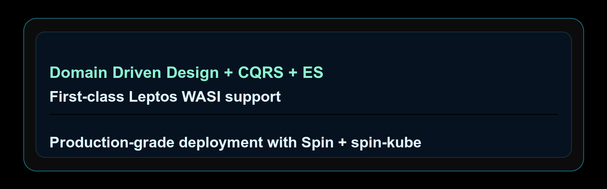

# ddd_cqrs_es

[](https://github.com/codeitlikemiley/ddd-cqrs-es/actions/workflows/ci.yml)

<p align="center">
  
</p>

`ddd_cqrs_es` is a Rust-native toolkit for building systems around Domain-Driven Design, CQRS, and Event Sourcing.

It gives you stable domain primitives, repositories, event stores, checkpoints, snapshots, idempotency helpers, projections, process managers, and a `ddd` CLI for scaffolding real applications without locking your domain to a web framework.

## Why Use It

- Keep business rules in pure aggregates, commands, events, and errors.
- Persist durable event history with SQLite, PostgreSQL, MySQL, Redis, or in-memory stores.
- Build read models with checkpointed projections.
- Handle production concerns like optimistic concurrency, request idempotency, snapshots, metadata, and event upcasting.
- Scaffold apps and fine-grained domain pieces with the `ddd` CLI.
- Deploy with native Rust services or Spin/WASI app templates.

## Quick Start with the CLI

Install the CLI:

```bash
cargo install ddd-cqrs-es-cli --locked
```

Create a domain-first project:

```bash
ddd init billing --preset basic --domain Invoice
cd billing
ddd add event Invoice InvoicePaid --field amount:i64 --field paid_at:String
ddd add command Invoice PayInvoice --field amount:i64
ddd check
```

Create a Spin-focused Leptos/WASI app:

```bash
ddd init counter-app --preset leptos-wasi --domain Counter --db sqlite --runtime spin --ui leptos
```

Preview generated changes before writing files:

```bash
ddd --dry-run --format json add event Invoice PaymentFailed --field reason:String
```

Useful discovery commands:

```bash
ddd capabilities --json
ddd matrix
```

## Use as a Library

Add the crate to `Cargo.toml`:

```toml
[dependencies]
ddd_cqrs_es = "0.2.6"
```

Enable only the adapters you need:

```toml
[dependencies]
ddd_cqrs_es = { version = "0.2.6", features = ["serde", "json", "sqlite"] }
```

Common features:

| Feature | Use |
| --- | --- |
| `sqlite` | SQLite event store, checkpoints, snapshots, and idempotency stores. |
| `postgres` | PostgreSQL event store, checkpoints, snapshots, and idempotency stores. |
| `mysql` | MySQL event store, checkpoints, snapshots, and idempotency stores. |
| `redis` | Experimental async Redis persistence and notification primitives. |
| `spin-sqlite`, `spin-postgres`, `spin-mysql`, `spin-redis` | Spin runtime helpers. |
| `wasi-neon`, `wasi-libsql`, `wasi-supabase-rpc` | WASI HTTP database helpers for edge deployments. |

## Storage and Realtime

The root crate owns durable domain, persistence, and projection primitives. Your application owns its HTTP, SSE, WebSocket, REST, gRPC, or UI layer.

Redis has two distinct roles:

- durable store: `db=redis` in generated app workflows
- wake transport: `realtime=redis`, where clients wake on notifications and replay durable events/checkpoints as the source of truth

SQLite, PostgreSQL, and MySQL are the stable SQL adapter family. Redis, WASI, and Spin helpers support edge and realtime-oriented deployments.

## Learn More

- Live docs: [https://ddd-cqrs-es.mintlify.site/](https://ddd-cqrs-es.mintlify.site/)
- CLI guide: [docs/cli.md](./docs/cli.md)
- Production guarantees: [docs/production/guarantees.md](./docs/production/guarantees.md)
- Persisted stores: [docs/production/persisted-store.md](./docs/production/persisted-store.md)
- Redis and realtime: [docs/production/redis.md](./docs/production/redis.md)
- Leptos/WASI tutorial: [docs/tutorial/leptos-ssr.md](./docs/tutorial/leptos-ssr.md)

## Agent Workflows

This repository includes local skills for agent workflows. Start with [SKILLS.md](./SKILLS.md) when using an agent on this repo.

## Contributing

Contributions are welcome. See [CONTRIBUTING.md](./CONTRIBUTING.md).

## License

Licensed under [LICENSE-MIT](./LICENSE-MIT).
