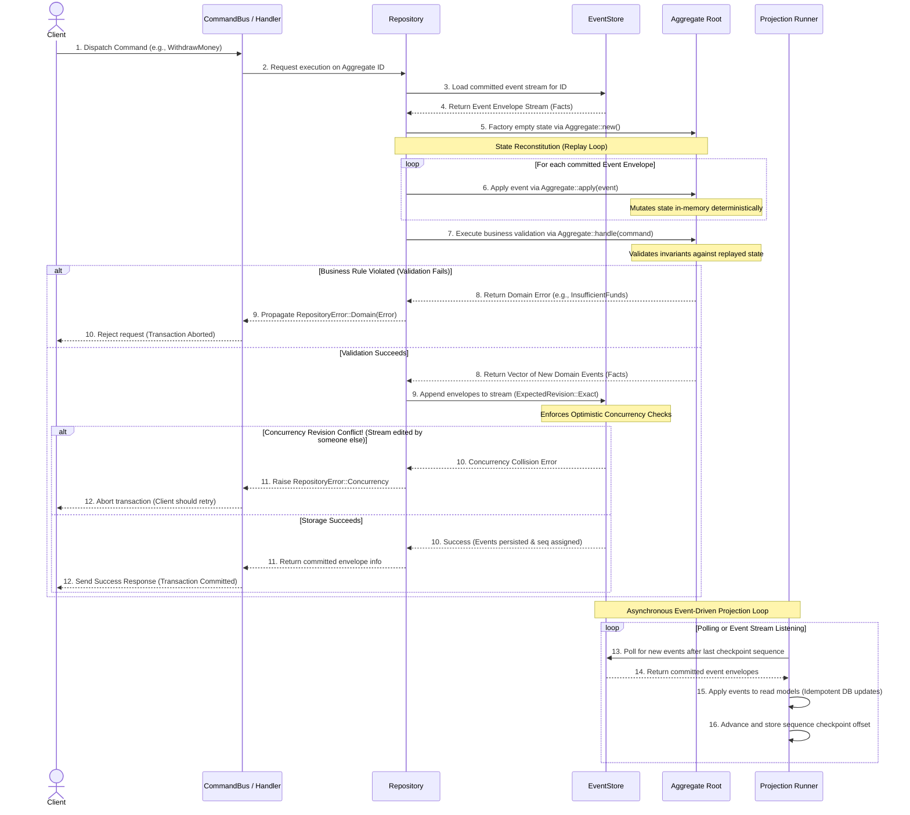

This framework is built upon three foundational software architectural patterns: **Domain-Driven Design (DDD)**, **Command Query Responsibility Segregation (CQRS)**, and **Event Sourcing (ES)**.

By understanding how these concepts fit together, you can design highly resilient applications that model real-world business domains with high fidelity.

---

## Core Domain-Driven Design (DDD) Concepts

Domain-Driven Design is an approach to software development that centers the design around a highly refined model of your business domain.

### 1. Ubiquitous Language
A shared, structured language used by both technical developers and non-technical business stakeholders (domain experts). The names of your Rust structs, methods, commands, and events must map exactly to real business concepts. For example, use `WithdrawMoney` rather than `UpdateBalanceWithNegativeDelta`.

### 2. Entities & Value Objects
- **Entities:** Objects that have a unique, stable identity over time, even if their attributes change (e.g., a `BankAccount` identified by an account number).
- **Value Objects:** Immutable objects that are defined solely by their attributes and have no identity of their own (e.g., an `Address` or `MoneyAmount`).

### 3. The Aggregate Root & Transactional Consistency
An **Aggregate** is a cluster of associated entities and value objects that are treated as a single unit for data changes. 
- The **Aggregate Root** is the sole entry point into this cluster.
- It serves as a **strict transactional consistency boundary**. Any modifications to any entity inside the aggregate must go through the root, ensuring that all business rules (domain invariants) are verified and enforced at all times.
- In our framework, this boundary is represented by implementing the `Aggregate` trait.

---

## Command Query Responsibility Segregation (CQRS)

Most traditional applications use a single data model to both write (mutate) and read (query) data. As applications scale, this leads to severe performance problems and schema conflicts because write paths need strict normalization for transactional integrity, while read paths need highly denormalized views for fast querying.

**CQRS** separates these two responsibilities into completely separate pipelines:

```
                  ┌───────────────────────────────┐
                  │            Client             │
                  └───────┬───────────────▲───────┘
                          │               │
                 Commands │ (Write Path)  │ Queries (Read Path)
                          ▼               │
               ┌─────────────────────┐    │    ┌─────────────────────┐
               │    Write Model      │    │    │     Read Model      │
               │ (Aggregate/Store)   │    │    │    (Projections)    │
               └──────────┬──────────┘    │    └──────────▲──────────┘
                          │               │               │
                    Events│               └───────────────┤Replays
                          ▼                               │
               ┌─────────────────────┐                    │
               │     Event Store     ├────────────────────┘
               │    (Fact Ledger)    │
               └─────────────────────┘
```

1. **The Write Path (Command Model):** Optimized strictly for validating business rules and appending events. It does not support complex joins or search queries; it only supports loading a single stream by ID, executing a command, and appending new events.
2. **The Read Path (Query Model):** Optimized strictly for high-speed, flexible data retrieval. It consists of **Projections** that listen to committed events asynchronously and update denormalized database tables (the read models) optimized for your specific UI screens.

---

## The Command Execution Lifecycle

The following diagram illustrates the complete step-by-step sequence of a client dispatching a command to execute a transaction and update the read model:



---

## Code Boundaries

In our codebase (`ddd_cqrs_es`), these boundaries are cleanly decoupled into specific Rust components:

### 1. The Consistency Boundary: `Aggregate`
Implemented by your core domain struct. It defines types for IDs, commands, events, and errors, and implements synchronous business logic validation (`handle`) and state replay logic (`apply`).

### 2. The Persistence Boundary: `EventStore`
The abstraction that stores committed events as historical envelopes. It enforces optimistic concurrency constraints and assigns global sequence offsets. We provide `InMemoryEventStore`, `SqliteEventStore`, and `PostgresEventStore` adapters.

### 3. The Orchestrator: `Repository`
The application coordinator. It fetches historical event logs from the store, replays them to reconstitute the aggregate state, executes the aggregate command handler, saves returned events back to the event store, and returns the committed state.

### 4. The Materializer: `Projection`
The read side consumer. It processes committed event envelopes sequentially to build highly-optimized, fast-querying views of your data.

---

## Next Steps

Learn how the persistence layer operates and stores these envelopes securely:
- Go to the [**Persistence & Event Storage Guide**](/persistence).
- Go to the [**Projections & Read Models Guide**](/projections).
