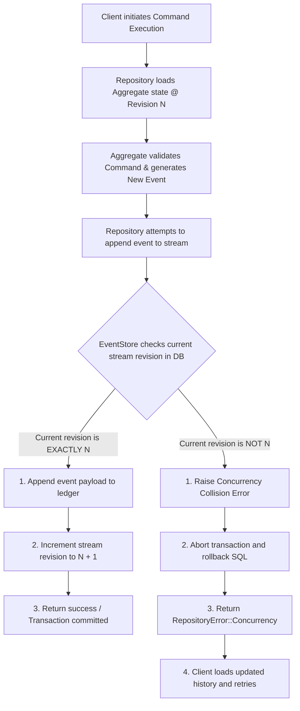

In a traditional database-driven application, you mutate state by overwriting existing data. In an Event Sourced system, state is saved as an immutable, sequential log of historical facts called an **Event Stream**. 

Because the history is preserved forever, the persistence layer must act as a reliable, high-performance, append-only ledger.

---

## Mechanics of Event Storage

An event store does not query records by arbitrary attributes during normal business operations. Instead, it is optimized to support two operations on the write path:
1. **Load Stream:** Retrieve all committed events belonging to a specific aggregate instance, ordered sequentially by their stream revision (`1`, `2`, `3`, ...).
2. **Append Stream:** Append a block of new events to the end of an aggregate instance's event stream.

---

## Optimistic Concurrency Control (OCC)

When multiple clients attempt to execute commands on the same aggregate instance simultaneously, they can cause race conditions. If Client A and Client B both load state at revision `5`, execute validations, and append events, they could corrupt the aggregate state if they proceed simultaneously.

To prevent this, our framework utilizes **Optimistic Concurrency Control**:
- When you load an aggregate, you fetch its current stream version (e.g., `ExpectedRevision::Exact(5)`).
- When you append new events, the event store checks if the stream's current revision in the database is still exactly `5`.
- If another process modified the stream first and advanced it to `6`, the append operation fails with a **concurrency violation** (`RepositoryError::Concurrency`).
- This approach avoids expensive row-level locks or distributed locking, enabling stateless application servers to scale horizontally.

---

## Optimistic Concurrency Flow

The diagram below details how the event store validates revisions to prevent state corruption:



---

## Standard Database Schema

Our relational database adapters (PostgreSQL and SQLite) share a unified table schema design. It enforces strict sequential revisions per aggregate stream while tracking global sequences for asynchronous query engines.

```sql
CREATE TABLE events (
    -- Unique monotonically increasing sequence number across all aggregate types
    -- Used by asynchronous Projection Runners to poll for new events
    sequence BIGSERIAL PRIMARY KEY,
    
    -- Universally unique identifier for this specific event instance
    event_id TEXT NOT NULL UNIQUE,
    
    -- Unique identifier of the aggregate instance (e.g., account-123)
    aggregate_id TEXT NOT NULL,
    
    -- The type of aggregate (e.g., bank_account)
    aggregate_type TEXT NOT NULL,
    
    -- The sequential version number of this event inside its specific stream
    revision BIGINT NOT NULL,
    
    -- Name of the event type (e.g., money_deposited)
    event_type TEXT NOT NULL,
    
    -- Schema version of this event payload
    event_version INT NOT NULL,
    
    -- Actual domain event payload serialized as JSON text or JSONB
    payload JSONB NOT NULL,
    
    -- Extensible envelope metadata (correlation ID, actor, tenancy) as JSONB
    metadata JSONB NOT NULL,
    
    -- Unix epoch timestamp when this event was committed
    recorded_at_ms BIGINT NOT NULL,
    
    -- Primary transaction guard: ensures no two events can occupy the same revision in a stream
    UNIQUE (aggregate_type, aggregate_id, revision)
);
```

---

## Configuring Database Adapters

Our framework provides built-in, production-ready adapters for in-memory, SQLite, and PostgreSQL environments.

### 1. In-Memory Store (Testing & Dev)
A fully thread-safe, local store utilizing `Arc<RwLock>` internally. It is perfect for rapid local testing and development.

```rust
use ddd_cqrs_es::{InMemoryEventStore, Repository};

// Initialize the store
let store = InMemoryEventStore::<BankAccount>::new();

// Bind to repository
let repo = Repository::new(store);
```

### 2. SQLite Store (Embedded & Local File)
Perfect for edge applications, local databases, or simple systems. Enable with the `"sqlite"` feature.

```rust
use ddd_cqrs_es::{SqliteEventStore, Repository};

fn setup_sqlite() -> Result<(), Box<dyn std::error::Error>> {
    // 1. Establish a standard rusqlite connection
    let connection = rusqlite::Connection::open("local_events.db")?;
    
    // 2. Wrap connection in our SqliteEventStore adapter
    let store = SqliteEventStore::<BankAccount>::new(connection);
    
    // 3. Initialize the database schema if it doesn't exist
    store.initialize_schema()?;
    
    let repo = Repository::new(store);
    Ok(())
}
```

### 3. PostgreSQL Store (Production Grade)
Designed for durable, production microservices. Handles high concurrency, automatic connection strings, and JSONB serialization. Enable with the `"postgres"` feature.

```rust
use ddd_cqrs_es::{PostgresEventStore, Repository};

fn setup_postgres() -> Result<(), Box<dyn std::error::Error>> {
    // 1. Connect to PostgreSQL using standard connection string
    let dsn = "host=localhost port=5432 user=postgres dbname=app_events sslmode=disable";
    let store = PostgresEventStore::<BankAccount>::connect(dsn)?;
    
    // 2. Initialize the physical database table structure
    store.initialize_schema()?;
    
    let repo = Repository::new(store);
    Ok(())
}
```

---

## Next Steps

Now that your events are safely persisted, learn how to consume them to build queryable databases:
- Go to the [**Projections & Read Models Guide**](/projections).
