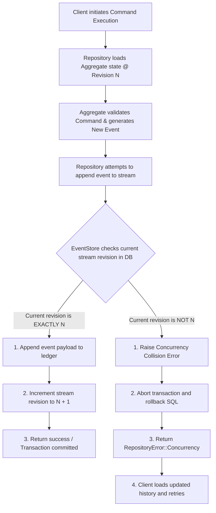

When transitioning from local testing to a production system, we need to persist our event streams to a durable, high-performance database.

A durable event store acts as our application's **immutable ledger**. It is highly optimized to support two primary operations:
1. **Load Stream:** Fetch all committed event envelopes for a specific Aggregate ID, ordered sequentially by their stream version.
2. **Append Stream:** Append a block of new events to the stream in a single transaction.

Read [Production Guarantees](./guarantees.md) before choosing APIs for a production command path. The generic APIs are portable; the native SQL adapters add transaction-aware idempotent append, durable snapshots, and transaction-friendly projection patterns. Read [Database Query Patterns](./db-query-patterns.md) before adding custom SQL or application read models.

---

## Optimistic Concurrency Control (OCC)

When multiple application server instances handle requests for the same aggregate instance simultaneously, they can cause race conditions. If Server A and Server B both load an account at revision `5`, execute validations, and attempt to append events, they could corrupt the aggregate state if both succeed.

To prevent this, our framework implements **Optimistic Concurrency Control**:
* When loading an aggregate, the repository tracks its current version (e.g., `ExpectedRevision::Exact(5)`).
* When appending events, the database adapter verifies that the current version of the stream in the database is still exactly `5`.
* If another request edited the stream first and advanced it to `6`, the transaction is rolled back and the append fails with a concurrency violation error (`RepositoryError::Concurrency`).

### OCC State Transition Flow



---

## Standard Relational Database Schema

Our SQLite and PostgreSQL adapters share a unified table schema design. It enforces strict sequential versions per aggregate stream while tracking a global sequence sequence for asynchronous projection engines.

```sql
CREATE TABLE events (
    -- Unique monotonically increasing sequence number across all aggregate types.
    -- Used by asynchronous Projection Runners to poll for new events.
    sequence BIGSERIAL PRIMARY KEY,
    
    -- Universally unique identifier for this specific event instance.
    event_id TEXT NOT NULL UNIQUE,
    
    -- Unique identifier of the aggregate instance (e.g., account-123).
    aggregate_id TEXT NOT NULL,
    
    -- The type of aggregate (e.g., bank_account).
    aggregate_type TEXT NOT NULL,
    
    -- The sequential version number of this event inside its specific stream.
    revision BIGINT NOT NULL,
    
    -- Name of the event type (e.g., money_deposited).
    event_type TEXT NOT NULL,
    
    -- Schema version of this event payload.
    event_version INT NOT NULL,
    
    -- Actual domain event payload serialized as JSON text or JSONB.
    payload JSONB NOT NULL,
    
    -- Extensible envelope metadata (correlation ID, actor, tenancy) as JSONB.
    metadata JSONB NOT NULL,
    
    -- Unix epoch timestamp when this event was committed.
    recorded_at_ms BIGINT NOT NULL,
    
    -- Primary transaction guard: ensures no two events can occupy the same revision in a stream.
    UNIQUE (aggregate_type, aggregate_id, revision)
);
```

---

## Configuring Database Adapters

Our framework supports multiple database options depending on your environment.

### Database Support Matrix

| Database Backend | Feature Flag | Supported Modes | Realtime Support | Production Ready |
| :--- | :--- | :--- | :--- | :--- |
| **SQLite** | `"sqlite"` | Native Sync (event, checkpoint, idempotency, snapshot, atomic idempotent append) | Yes (via SSE polling/polling stream) | Yes |
| **PostgreSQL** | `"postgres"` | Native Sync (event, checkpoint, idempotency, snapshot, atomic idempotent append) | Yes (via SSE polling/polling stream) | Yes |
| **LibSQL / Turso** | `"wasi-libsql"` | Async HTTP / Hrana SQL query helpers | Counter app supports SSE polling or Redis wake | Experimental / WASM |
| **Redis** | `"redis"` | Async (event, checkpoint, pub/sub) | Yes (via Pub/Sub / SSE notifications) | Experimental / WASM |
| **MySQL** | `"mysql"`, `"wasi-mysql"`, `"spin-mysql"` | Native Sync stores plus raw TCP Wasmtime and Spin SDK query helpers | Counter app supports SSE polling or Redis wake | Yes for native stores; runtime helpers are experimental / WASM |

#### To Enable Durable Database Adapters:

Custom schema table names are validated when constructing `SqlSchemaConfig`:

```rust
let config = ddd_cqrs_es::SqlSchemaConfig::new(ddd_cqrs_es::SqlDialect::Postgres)
    .with_events_table("tenant_a_events")?;
```
* **SQLite Support:** Enable the `"sqlite"` feature.
* **PostgreSQL Support:** Enable the `"postgres"` feature.
* **MySQL Support:** Enable the `"mysql"` feature.
* **WASI MySQL Helper:** Enable `"wasi-mysql"` for raw TCP MySQL query execution from generic Wasmtime/WASI runtimes.
* **Spin MySQL Helper:** Enable `"spin-mysql"` for Spin SDK MySQL query execution.
* **LibSQL Support:** Enable the `"wasi-libsql"` feature.
* **Redis Support:** Enable the `"redis"` feature with `"wasi-redis"` or `"spin-redis"`.

> [!NOTE]
> We support SQLite, PostgreSQL, MySQL, LibSQL, and Redis backends.
> The library provides durable stores, checkpoint stores, idempotency stores, and notification primitives. Push-style realtime delivery is application-owned: use polling, SSE, WebSocket, an outbox worker, binlog CDC, Redis, NATS, Kafka, or another fan-out layer as appropriate. Redis pub/sub support is notification-only; durable event replay remains the source of truth.

For request idempotency, prefer `Repository::execute_idempotent_atomic` with the native SQL event stores. `Repository::execute_idempotent` remains available for portable and non-strict workloads, but it coordinates a separate idempotency store and is not crash-atomic across both stores.

### 1. SQLite Store (Embedded File)
Perfect for edge applications, local databases, or desktop apps. Enable with the `"sqlite"` feature.

```rust
use ddd_cqrs_es::{SqliteEventStore, Repository};

fn setup_sqlite() -> Result<Repository<BankAccount, SqliteEventStore<BankAccount>>, Box<dyn std::error::Error>> {
    // 1. Establish a standard rusqlite connection
    let connection = rusqlite::Connection::open("local_events.db")?;
    
    // 2. Wrap connection in our SqliteEventStore adapter
    let store = SqliteEventStore::<BankAccount>::new(connection)?;
    
    // 3. Initialize the database schema if it doesn't exist
    store.initialize_schema()?;
    
    let repo = Repository::new(store);
    Ok(repo)
}
```

### 2. PostgreSQL Store (Production Microservice)
Designed for high-concurrency production microservices. Enable with the `"postgres"` feature.

```rust
use ddd_cqrs_es::{PostgresEventStore, Repository};

fn setup_postgres() -> Result<Repository<BankAccount, PostgresEventStore<BankAccount>>, Box<dyn std::error::Error>> {
    // 1. Connect to PostgreSQL using standard connection string
    let dsn = "host=localhost port=5432 user=postgres dbname=app_events sslmode=disable";
    let store = PostgresEventStore::<BankAccount>::connect(dsn)?;
    
    // 2. Initialize the physical database table structure
    store.initialize_schema()?;
    
    let repo = Repository::new(store);
    Ok(repo)
}
```

### 3. Redis Store (Experimental Async)
Redis support is async-only and experimental. Enable `"redis"` with either
`"wasi-redis"` for the raw RESP WASI client or `"spin-redis"` for Spin SDK
Redis. The adapter uses a Lua append script for atomic expected-revision
checks, global sequence allocation, stream revision updates, and event indexes.

```rust,no_run
use ddd_cqrs_es::{AsyncRepository, RedisEventStore, WasiRedisClient};

# async fn setup_redis() -> Result<(), Box<dyn std::error::Error>> {
let client = WasiRedisClient::new("redis://127.0.0.1:6379");
let store = RedisEventStore::<BankAccount, _>::new(client);
let repo = AsyncRepository::new(store);
# Ok(())
# }
```

Redis pub/sub helpers are notification-only. Consumers should use pub/sub or
SSE to wake clients, then read durable events or read models for truth.

See [Redis Event Store and Realtime](./redis.md) for the Redis key layout,
feature flags, runtime clients, counter-app commands, and current limitations.
