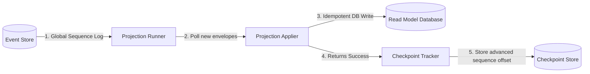

Because the write path of an Event Sourced system is restricted to loading streams by aggregate ID, you cannot perform complex search queries, joins, or aggregations directly against your event store. 

To support querying, we use the **Read Side** (or Query Model) of CQRS, composed of **Projections** and **Read Models**.

---

## Eventual Consistency

A **Projection** is a background worker that consumes committed events from the event store and applies them to a separate database (the **Read Model**) that is structured specifically to make UI queries fast and simple.

Because projections execute *after* events are committed to the event store, there is a tiny delay between when a command is completed and when the read model updates. This behavior is called **Eventual Consistency**.

```
[ Command Committed ] ──(latency boundary)──► [ Projection Applied ] ──► [ UI Query Updated ]
```

---

## The Checklist for Reliable Projections

When designing projections, you must adhere to two golden rules to ensure your system behaves reliably in production:

### 1. Projections MUST be Idempotent
If your application crashes mid-execution, a projection runner will restart and retry applying the last block of events. Your projection logic must handle processing the same event multiple times without corrupting your read model (e.g., performing UPSERTs instead of blind INSERTs, or verifying revision numbers before writing).

### 2. Projections MUST be Sequential
To maintain accurate read states, events must be processed in the exact order they were committed. We enforce this order by tracking a **Checkpoint** (or sequence offset) that represents the global event position successfully processed by the runner.

---

## Asynchronous Projection Pipeline

The following diagram illustrates how the Projection Runner processes committed events sequentially and manages checkpoint tracking:



---

## Complete Projection Implementation

Let's implement a real projection that builds a fast-querying dashboard summary of total bank account balances using our actual `Projection` and `InMemoryProjectionRunner` APIs:

```rust
use ddd_cqrs_es::{EventEnvelope, Projection, InMemoryProjectionRunner, InMemoryEventStore};
use std::collections::HashMap;

// =========================================================================
// 1. Define the Read Model State
// =========================================================================
// A simple, query-optimized in-memory database to store total active balances.
#[derive(Default, Debug)]
pub struct AccountDashboard {
    balances: HashMap<String, u64>,
}

impl AccountDashboard {
    pub fn get_balance(&self, account_id: &str) -> Option<u64> {
        self.balances.get(account_id).copied()
    }
}

// =========================================================================
// 2. Implement the Projection Trait
// =========================================================================
impl Projection<BankAccountEvent, String> for AccountDashboard {
    type Error = std::convert::Infallible;

    // Unique name identifier for the projection, used to isolate checkpoints
    fn name(&self) -> &'static str {
        "account_dashboard_view"
    }

    // Apply is invoked sequentially for every committed event envelope.
    // It must perform idempotent modifications to the read model.
    fn apply(&mut self, envelope: &EventEnvelope<BankAccountEvent, String>) -> Result<(), Self::Error> {
        let account_id = envelope.aggregate_id.clone();
        
        match &envelope.payload {
            BankAccountEvent::AccountOpened { .. } => {
                // Initialize balance idempotently
                self.balances.entry(account_id).or_insert(0);
            }
            BankAccountEvent::MoneyDeposited { amount } => {
                let balance = self.balances.entry(account_id).or_insert(0);
                *balance += amount;
            }
            BankAccountEvent::MoneyWithdrawn { amount } => {
                let balance = self.balances.entry(account_id).or_insert(0);
                // Prevent underflows defensively
                *balance = balance.saturating_sub(*amount);
            }
        }
        
        Ok(())
    }
}
```

---

## Polling and Replaying Events

With our projection defined, we can feed it committed events using the `InMemoryProjectionRunner`:

```rust
fn run_projections(
    store: &InMemoryEventStore<BankAccount>,
    dashboard: AccountDashboard
) -> Result<AccountDashboard, Box<dyn std::error::Error>> {
    
    // 1. Initialize our sequential runner wrapping the dashboard view
    let mut runner = InMemoryProjectionRunner::new(dashboard);

    // 2. Poll the event store and replay all new events committed since
    // the runner's last checkpoint.
    runner.run::<BankAccount, _>(store)?;

    // 3. Extract and return the fully populated read model
    let updated_dashboard = runner.into_inner();
    Ok(updated_dashboard)
}
```

---

## Next Steps

Learn how to write fast unit tests for your aggregate validations without setting up database stores or projection runners:
- Go to the [**Behavior-Driven Development Guide**](/testing).
