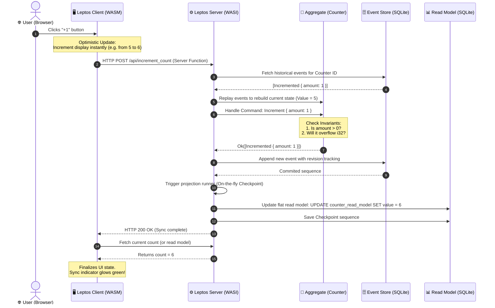

# Leptos WASM SSR + Spin CQRS: Production Implementation

In this advanced tutorial, we will design, build, and deploy a complete, production-ready, full-stack reactive application using **Leptos** (WebAssembly Server-Side Rendering), **WASI**, and **Fermyon Spin** powered by our extensible `ddd_cqrs_es` framework.

By the end of this guide, you will understand how to model a domain using Event Sourcing, implement highly optimized read-model projections, overcome the compilation limits of WebAssembly inside sandboxed microservices, and deliver a zero-latency, reactive UI using optimistic updates and server actions.

---

## 🗺️ Architectural Blueprint

Before we dive into the code, let's look at the flow of a modern, full-stack CQRS and Event Sourced system. Here is how commands flow from the interactive Leptos UI on the client, get validated and processed on the server, persist in our event store, update projections sequentially, and hydrate the reactive client-side interface:

---

---

## Guide Sections

This implementation guide is split into focused pages so each production concern can be read and maintained independently:

1. [Domain Modeling and Pure Domain](./leptos-ssr-domain)
2. [WASM and Spin Storage](./leptos-ssr-spin-storage)
3. [Projections and Checkpointing](./leptos-ssr-projections)
4. [Leptos Server APIs](./leptos-ssr-server-api)
5. [Reactive Leptos UI](./leptos-ssr-ui)
6. [Runtime Configuration and Backends](./leptos-ssr-runtime-backends)
7. [Execution and Testing Playbook](./leptos-ssr-execution)
8. [Architecture Payoff](./leptos-ssr-architecture-payoff)

Future deployment material, such as a dedicated SpinKube production guide, should live as its own page in this runtime section instead of being appended to this overview.
